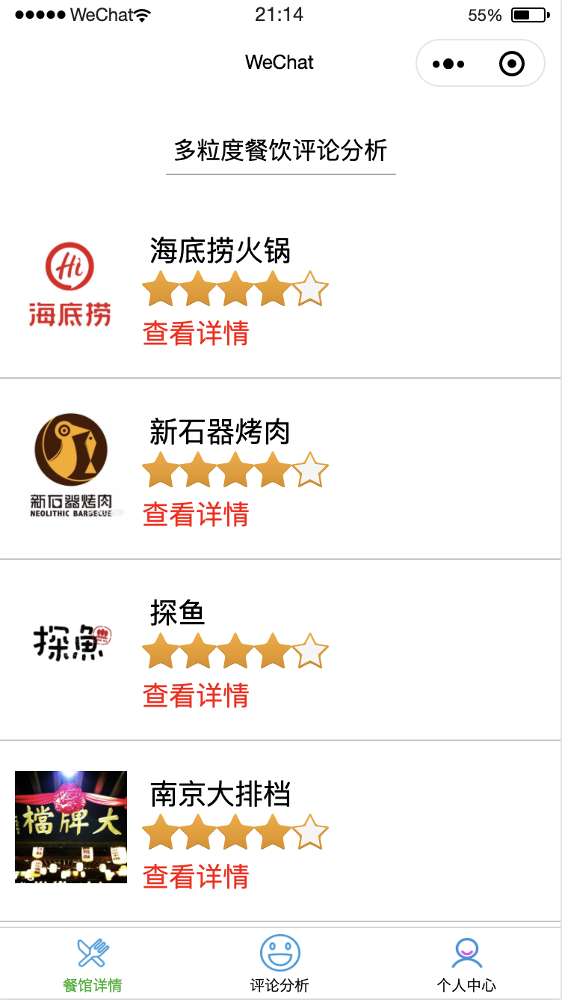

Multi-Granularity-Comment-Analysis

北邮研究生创新创业项目——面向餐饮行业的多粒度评论分析系统

### 主要模块

- 前端：微信小程序
- 后台：Flask框架
- 数据库：MongoDB
- 算法模型：GCAE
- 深度学习框架：Pytorch

-----------------

### 展示界面

<table>
    <tr>
        <td >

        
</td>
        <td >

        
</td>
    </tr>
</table>

<table>
    <tr>
        <td >

        
</td>
        <td >

        
</td>
    </tr>
</table>

--------------------

### TODO：

- [x] 数据清洗，去掉无关符号。 2020/8/17完成
- [x] 数据输入格式转换：sentence aspect label  2020/8/16完成
- [x] 去除超过500字符长度的数据 2020/8/17完成
- [x] 使用GCAE模型：[[paper]](https://www.aclweb.org/anthology/P18-1234/) [[code]](https://github.com/wxue004cs/GCAE) 2020/8/16完成
- [x] 转换后的数据标签分布不均，可以去掉一些标签为 not mentioned 的数据（只针对GCAE模型） 2020/8/17完成
- [x] 优化小程序情感分析界面 2020/8/27完成
- [x] 小程序可视化商家评论情况 2020/9/2完成
- [x] 增加商家数据库 2020/8/27完成
- [x] 情感得分计算算法 2020/8/27完成
- [x] 评论分析中 textarea 输入框左右边界不对齐 2020/9/2完成
- [x] 优化雷达图 2020/9/3完成

--------------------

### Licence

MIT